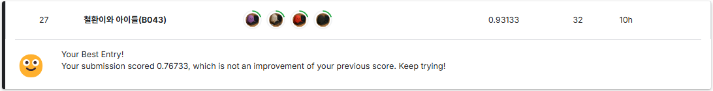
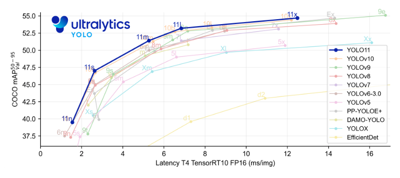
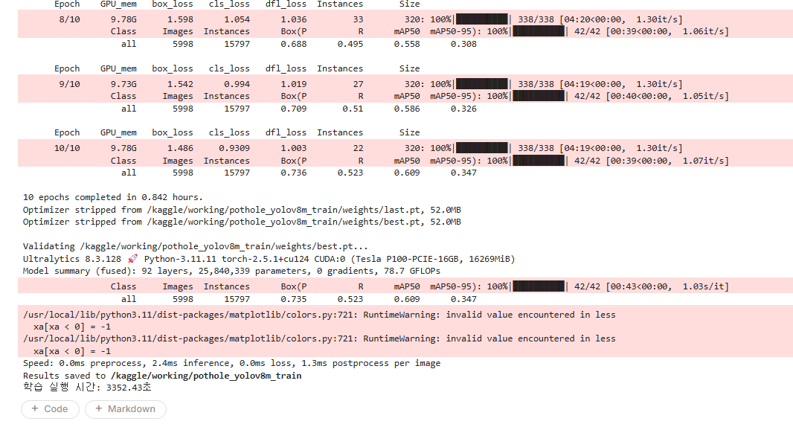
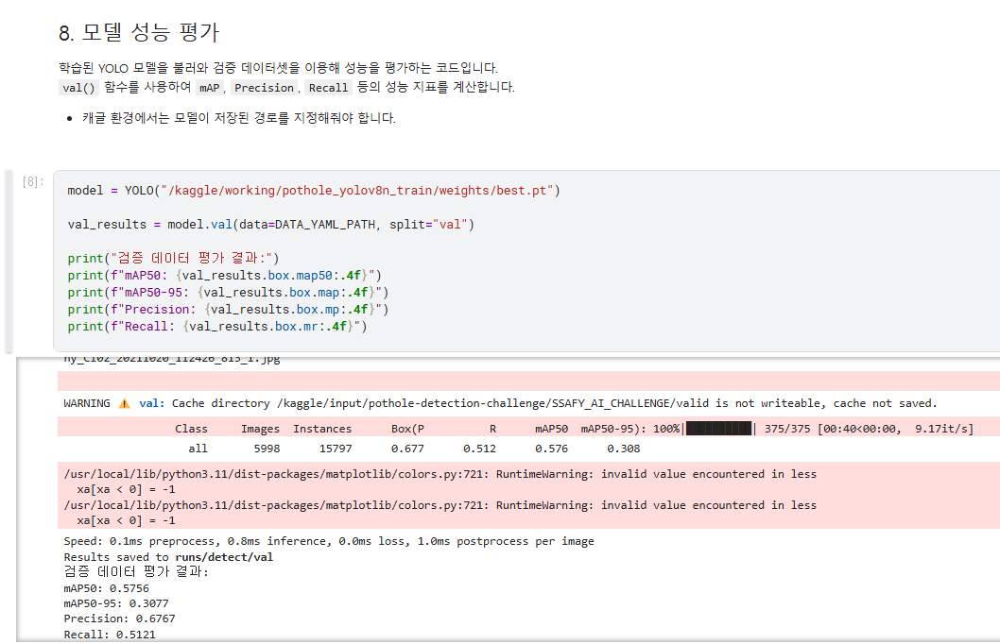
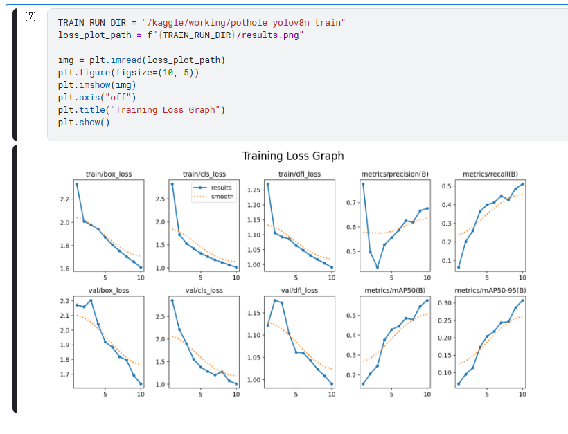

# Team
### `철환이와 아이들(B043)`


## **전략**

[1] 다양한 모델들로 적합한 모델 탐색

[2] 해당 모델의 하이퍼 파라미터 수정을 통한 최적화

[3] 최적화 과정에 만들어진 best모델 3개를 활용하여 앙상블 모델 구축

---

### 모델 탐색



**모델 후보군**
1. yolov8

    - 기본적으로 주어진 모델
    - 가장 대중적으로 많이 사용된 모델 (= 예제가 많음)
2. yolov9
    - 공식 문서 기준 가장 정확도가 좋은 모델 (yolov9e)
3. yolo11
    - 아직 불안정한 12를 제외한 가장 최신 모델
    - 학습 시간 대비 성장 폭이 가장 큰 모델

---

### **선정 방법**

4명의 팀원이 모델을 동일한 조건으로 2개씩 맡아서 진행
  - yolov8n / yolov8m / yolov8x
  - yolov9e
  - yolo11n / yolo11m / yolo11x

---

### **실험 조건**

- 조건 1. kaggle cloud `GPU P100` 에서 진행

- 조건 2. 하이퍼 파라미터 설정 최소화
```
imgsz = 320   # 빠른 학습을 위해 낮은 화질
epochs = 10   # 빠른 학습을 위해 작은 epochs
batch = 0.85  # 학습 최적화를 위해 자동 배치 모드 (GPU 85% 활용하는 배치 사이즈로 자동 선택. spike를 방지하기 위해 85%만 사용)
worker = 4    # 메모리 절약을 위해 작은 사이즈 (default = 8)
```

---

## 실험 결과 
- 자세한 내용은 `ModelSelection`을 참고하세요.








**결과**
| model | train time | mAP50 |
| --- | --- | --- |
| yolov8n | 2536.19s | 0.5756 |
| yolov8m | 3352.43s | 0.6082 |
| yolov8x | 6896.36s | 0.6286  |
| yolov9e | 9086.95 | 0.5846 |
| yolo11n | ... | ... |
| yolo11m | ... | ... |
| yolo11x | ... | ... |

따라서 yolo11m을 사용하기로 결정 (결과적으로는 정확도를 위해 11x 또한 활용함)

---
### YOLO11

**하이퍼 파라미터 목록**

